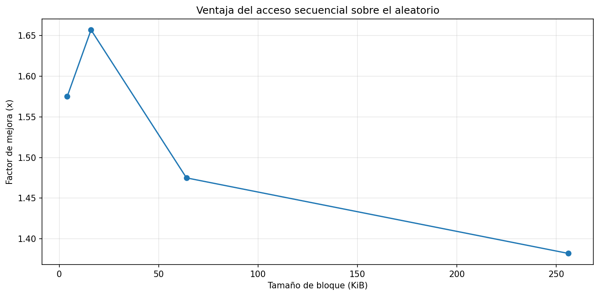
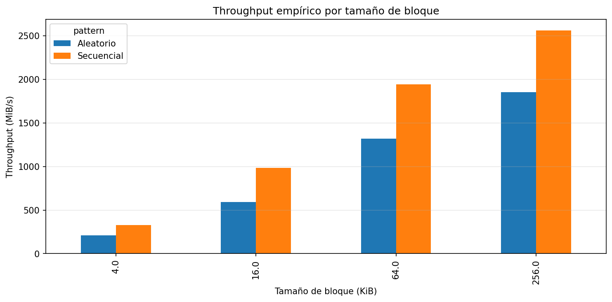
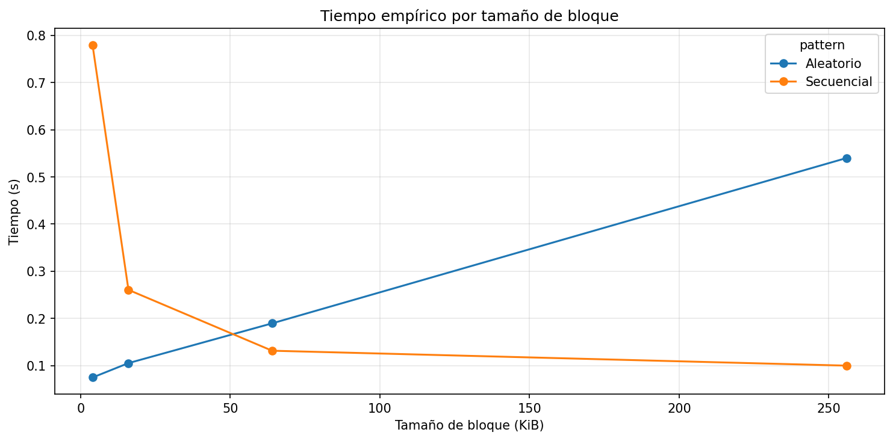
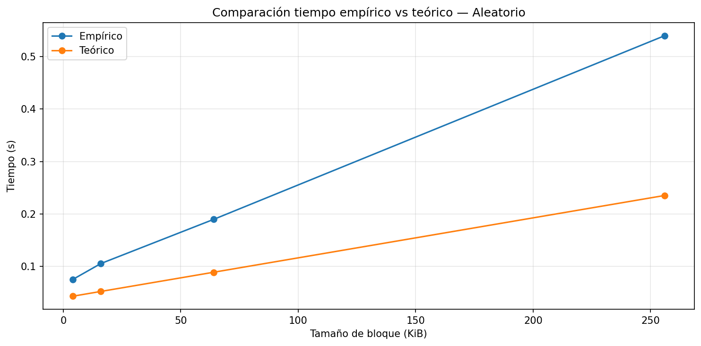
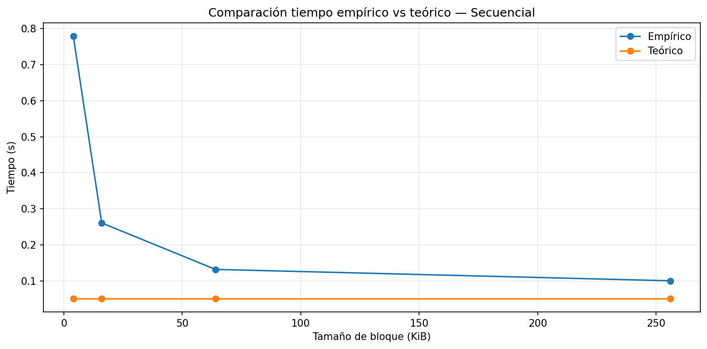

# lab3-IO_performance-SofiaEspinal

## Datos
Sofia Espinal Vásquez - 1042151247 

sofia.evasquez@udea.edu.co

## Especificaciones del equipo

| Parámetro | Valor    |
|-----------|----------|
| Sistema Operativo | Windows 11 Pro 22H2  |
| CPU (Modelo y Núcleos) | Intel(R) Celeron(R) N4020/ 2 núcleos |
| Memoria RAM Total | 8GB DDR4 |
| Tipo de disco | SSD NVMe  |
| Carga de CPU en Reposo | 8.07%  |

## Resultados del experimento

.
.
.
.
.

## Análisis y conclusiones 

### 1. Diferencial de Desempeño
En mi máquina, el acceso secuencial fue claramente más eficiente que el acceso aleatorio en todos los casos. Por ejemplo, con un tamaño de bloque de 256 KB, el throughput secuencial llegó a 2558.98 MiB/s, mientras que el aleatorio fue de 1851.37 MiB/s, lo que representa una ventaja de aproximadamente 1.38 veces. Esto tiene sentido porque, cuando los datos se leen de forma continua, el sistema puede trabajar de manera más fluida sin tener que “saltar” entre posiciones. Esto está muy relacionado con el concepto de localidad espacial, donde acceder a datos cercanos mejora el rendimiento.

### 2. Efecto del Tamaño de Bloque
Algo que se nota bastante en los resultados es que el tamaño del bloque influye mucho en el rendimiento. A medida que el bloque crece, el throughput también aumenta; por ejemplo, en acceso secuencial pasó de unos 328 MiB/s con 4 KB a más de 2558 MiB/s con 256 KB. En el caso del acceso aleatorio también mejora, aunque sigue siendo más lento. Esto ocurre porque al leer bloques más grandes se reduce la cantidad de accesos necesarios, y así el costo de cada operación se reparte mejor. En otras palabras, se aprovecha mejor cada lectura, lo que conecta con la idea de amortizar costos.

### 3. Correlación con la Teoría
En general, los resultados coinciden bastante bien con lo que dice la teoría: el acceso secuencial es más rápido y los bloques grandes mejoran el rendimiento. Sin embargo, hay detalles interesantes, como que la ventaja del acceso secuencial disminuye en bloques grandes; por ejemplo, fue de aproximadamente 1.66× en 16 KB, pero bajó a 1.38× en 256 KB. Esto muestra que en la práctica influyen más factores de los que a veces se consideran en teoría, como la caché del sistema operativo, la interfaz del disco o incluso condiciones físicas del hardware. Es decir, el modelo teórico se cumple, pero no explica todo al 100%.

### 4. Costo de Acceso
Aunque los SSD son mucho más rápidos que los discos duros tradicionales, el acceso aleatorio sigue siendo más costoso que el secuencial. Esto se debe a que internamente el SSD tiene que ubicar los datos en memoria y gestionar estructuras como tablas de mapeo, lo que introduce cierto retraso. Esto se ve en los resultados, donde incluso en el mejor caso el acceso aleatorio (1851.37 MiB/s) no alcanza al secuencial (2558.98 MiB/s). Es decir, aunque ya no hay partes mecánicas, todavía existen costos internos que afectan el rendimiento.

### 5. Implicaciones en Sistemas
Si tuviera que diseñar un motor de base de datos, intentaría organizar los datos para que se lean de forma secuencial la mayor parte del tiempo. Por ejemplo, almacenando registros de manera contigua o haciendo lecturas en bloques grandes. Esto es importante porque, como se vio en los resultados, la diferencia puede ser significativa, llegando hasta 1.66 veces más rápido en algunos casos. En la práctica, esto significa que pequeñas decisiones de diseño pueden tener un impacto grande en el rendimiento, especialmente cuando se manejan grandes volúmenes de datos.

